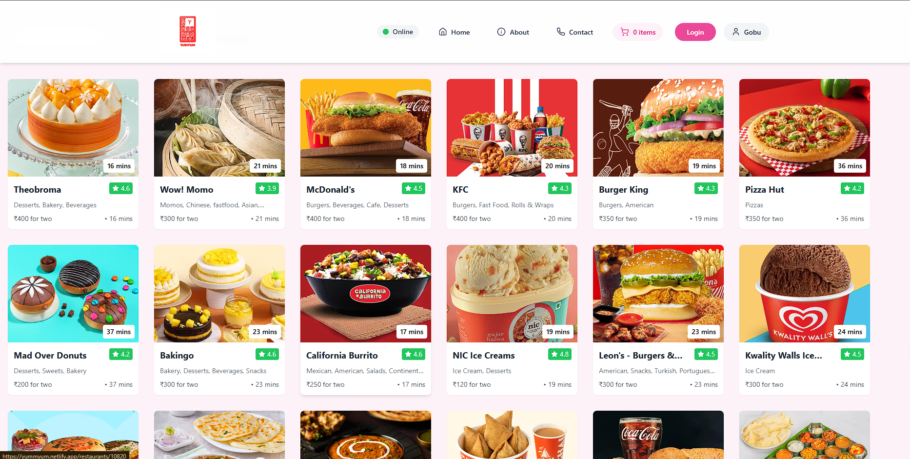
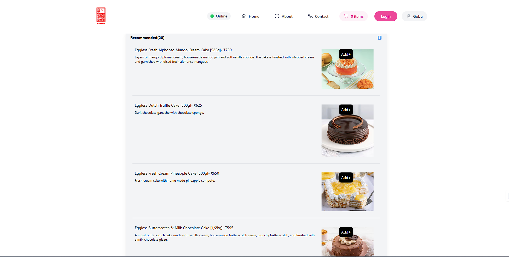
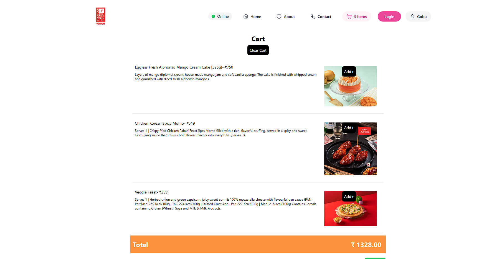

# 🍔 YumYum

<div align="center">
  
  
  
</div>


---

## 🥗 What is YumYum?

**YumYum** is a modern, feature-rich food ordering web application designed to make your dining experience seamless and enjoyable. Discover new restaurants, explore trending dishes, order food online, and track your delivery—all in one place. Whether you’re a foodie or a restaurant owner, YumYum connects cravings with kitchens!

---

## 🚀 Live Demo

> **Experience YumYum:**  
> [https://yummyum.netlify.app/](https://yummyum.netlify.app/)

---

## ✨ Features

- 🏪 **Discover Restaurants:** Browse curated lists and trending places
- 🍱 **Smart Menu Explorer:** Filter cuisines, search dishes, and view detailed menus
- 👤 **User Authentication:** Secure sign-up, login, and profile management
- 🛒 **Cart & Online Ordering:** Add to cart, customize orders, and checkout in seconds
- 💳 **Payment Integration:** (If implemented) Pay securely with modern payment gateways
- 📦 **Order Tracking:** Real-time updates on your order status
- ⭐ **Restaurant Ratings & Reviews:** Share your experience and help others decide
- 📱 **Responsive & Mobile-Optimized:** Enjoy YumYum on any device
- 🎨 **Modern UI/UX:** Clean, beautiful, and intuitive interface
- 🛠️ **Admin Dashboard:** (If available) Restaurant management, analytics, and more

---

## 🏗️ Tech Stack

<p align="center">
  
</p>

- **Frontend:** React.js, Tailwind CSS, Redux Toolkit (if used)
- **Backend:** Node.js, Express.js
- **Database:** MongoDB (Mongoose)
- **Authentication:** JWT, bcrypt
- **Hosting:** Netlify (Frontend), Render/Heroku (Backend)
- **Other:** RESTful APIs, Framer Motion (for animations), Cloudinary (for images, if used)

---

## 🖼️ Screenshots

<p align="center">
  
  <br><sub>Homepage</sub>
  <br><br>
  
  <br><sub>Menu & Ordering</sub>
  <br><br>
  
  <br><sub>Cart & Checkout</sub>
</p>

---

## 🛠️ Getting Started

### 1. **Clone the repository**

```bash
git clone https://github.com/GouravSittam/YumYum.git
cd YumYum
```

### 2. **Setup Backend**

```bash
cd backend
npm install
```
Create a `.env` file in `/backend`:

```env
PORT=5000
MONGO_URI=your_mongodb_connection_string
JWT_SECRET=your_secret_key
```
Start the backend server:

```bash
npm start
```

### 3. **Setup Frontend**

```bash
cd ../frontend
npm install
```
Create a `.env` file in `/frontend`:

```env
REACT_APP_API_URL=http://localhost:5000
```
Start the frontend:

```bash
npm start
```

### 4. **Visit the App**

Open [http://localhost:3000](http://localhost:3000) in your browser.

---

## ⚙️ Project Structure

```
YumYum/
├── backend/
│   ├── controllers/
│   ├── models/
│   ├── routes/
│   ├── middleware/
│   └── server.js
├── frontend/
│   ├── src/
│   │   ├── assets/
│   │   ├── components/
│   │   ├── pages/
│   │   ├── redux/
│   │   ├── App.js
│   │   └── index.js
└── README.md
```

---

## 📝 Customization

- **Restaurants, menus, and user data** are seeded in the backend (update `/backend/seeders` if applicable).
- **Edit site branding, logo, or styles** in `/frontend/src/assets` and Tailwind config.
- **Add new features** by creating new components and routes.

---

## 🧑‍💻 Contributing

Contributions, issues, and feature requests are welcome!  
1. Fork the repository  
2. Create your branch: `git checkout -b feature/amazing-feature`  
3. Commit your changes: `git commit -am 'Add amazing feature'`  
4. Push to the branch: `git push origin feature/amazing-feature`  
5. Open a Pull Request  

---

## 📫 Contact & Social

<p align="center">
  <a href="mailto:gouravsittam@gmail.com"></a>
  <a href="https://linkedin.com/in/gouravsittam"></a>
  <a href="https://x.com/Gouravv_c"></a>
  <a href="https://github.com/GouravSittam"></a>
</p>

---

## ⭐ Credits & Acknowledgements

- Thanks to the open source community for libraries and inspiration!
- [skillicons.dev](https://skillicons.dev) for tech badges
- All contributors and testers

---

## 📝 License

This project is licensed under the [MIT License](LICENSE).

---

<div align="center">
  
  <br>
  <i>Bon appétit! — Built with ❤️ by Gourav Chaudhary</i>
</div>
