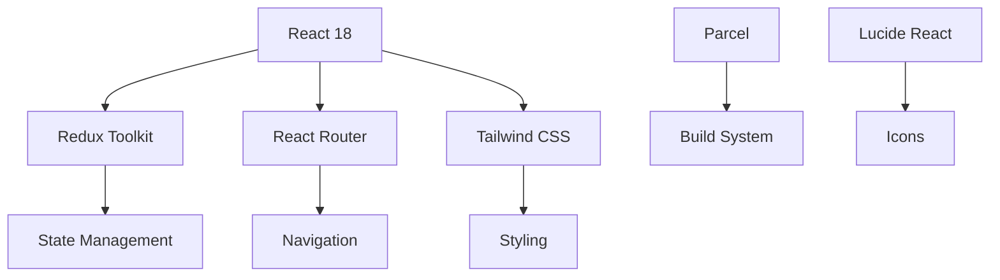

<div align="center">

# 🍽️ YumYum - Food Delivery Experience


### *Where Every Click Leads to Deliciousness* 🚀

[](https://reactjs.org/)
[](https://redux.js.org/)
[](https://tailwindcss.com/)
[](https://developer.mozilla.org/en-US/docs/Web/JavaScript)
[](https://parceljs.org/)

[](https://opensource.org/licenses/ISC)
[](https://github.com/GouravSittam)

---

**YumYum** is a cutting-edge food delivery platform that revolutionizes your dining experience. Built with modern React architecture and powered by real-time restaurant data, it offers seamless food discovery, ordering, and delivery tracking in a beautifully crafted interface.

[🚀 Live Demo](#) • [📖 Documentation](#installation) • [🐛 Report Bug](https://github.com/GouravSittam/YumYum/issues) • [✨ Request Feature](https://github.com/GouravSittam/YumYum/issues)

</div>

---

## 🌟 Features That Make YumYum Special

<div align="center">

| 🔥 **Core Features** | 🎨 **UI/UX** | ⚡ **Performance** |
|:---:|:---:|:---:|
| Real-time Restaurant Data | Responsive Design | Code Splitting |
| Smart Search & Filters | Modern Animations | Lazy Loading |
| Shopping Cart System | Mobile-First Approach | Optimized Bundling |
| Secure Payment Gateway | Dark/Light Theme Ready | Fast Loading |

</div>

### 🚀 **What You Can Do**

- 🔍 **Discover** restaurants with advanced search and filtering
- 📱 **Browse** menus with beautiful, responsive cards
- 🛒 **Add to Cart** with real-time state management
- 💳 **Secure Checkout** with integrated payment system
- 📍 **Track Orders** with live status updates
- 🌐 **Offline Support** with connection status detection
- 📊 **Filter by Rating** to find top-rated restaurants
- 🎯 **Personalized Experience** with user context

---

## 🛠️ Tech Stack & Architecture

<div align="center">

### **Frontend Powerhouse**



</div>

| Technology | Version | Purpose |
|------------|---------|---------|
| **React** | `18.3.1` | Core UI library with hooks |
| **Redux Toolkit** | `2.2.8` | Predictable state management |
| **React Router** | `6.28.0` | Client-side routing |
| **Tailwind CSS** | `3.4.13` | Utility-first styling |
| **Parcel** | `2.12.0` | Zero-config build tool |
| **Lucide React** | `0.453.0` | Beautiful icon system |

### 🏗️ **Project Architecture**

```
src/
├── 📁 components/          # Reusable UI components
│   ├── Header.jsx         # Navigation & user controls
│   ├── Body.jsx           # Main restaurant listing
│   ├── Cart.jsx           # Shopping cart functionality
│   └── ...
├── 📁 Utils/              # Utilities & state management
│   ├── AppStore.jsx       # Redux store configuration
│   ├── CartSlices.jsx     # Cart state management
│   └── UserContext.jsx    # User context provider
└── App.jsx                # Main application component
```

---

## 🚀 Quick Start Guide

### Prerequisites

Make sure you have these installed:
- **Node.js** (v16 or higher)
- **npm** or **yarn**
- **Git**

### ⚡ Installation

```bash
# Clone the repository
git clone https://github.com/GouravSittam/YumYum.git

# Navigate to project directory
cd YumYum

# Install dependencies
npm install

# Start development server
npm start
```

### 🔧 Available Scripts

| Command | Description |
|---------|-------------|
| `npm start` | 🚀 Start development server |
| `npm run build` | 📦 Build for production |
| `npm test` | 🧪 Run test suite |

---

## 📱 Screenshots & Demo

<div align="center">

### 🏠 **Home Page**
*Beautiful restaurant discovery with search and filters*

### 🛒 **Shopping Cart**
*Seamless cart management with real-time updates*

### 📱 **Mobile Experience**
*Fully responsive design for all devices*

</div>

---

## 🎯 Key Features Deep Dive

### 🔍 **Smart Restaurant Discovery**
- Real-time data from Swiggy API
- Advanced search functionality
- Rating-based filtering
- Responsive restaurant cards

### 🛒 **Shopping Cart System**
- Redux-powered state management
- Add/remove items seamlessly
- Real-time price calculation
- Persistent cart state

### 📱 **Responsive Design**
- Mobile-first approach
- Tailwind CSS utilities
- Modern animations
- Cross-browser compatibility

### ⚡ **Performance Optimizations**
- Code splitting with React.lazy()
- Dynamic imports
- Optimized bundle size
- Fast loading times

---

## 🤝 Contributing

We love contributions! Here's how you can help make YumYum even better:

1. **Fork** the repository
2. **Create** a feature branch (`git checkout -b feature/AmazingFeature`)
3. **Commit** your changes (`git commit -m 'Add some AmazingFeature'`)
4. **Push** to the branch (`git push origin feature/AmazingFeature`)
5. **Open** a Pull Request

### 🐛 **Found a Bug?**
Please [open an issue](https://github.com/GouravSittam/YumYum/issues) with:
- Bug description
- Steps to reproduce
- Expected vs actual behavior
- Screenshots (if applicable)

---

## 📄 License

This project is licensed under the **ISC License** - see the [LICENSE](LICENSE) file for details.

---

## 👨‍💻 About the Developer

<div align="center">

**Gourav Chaudhary**

*Full Stack Developer passionate about creating amazing user experiences*

[](https://github.com/GouravSittam)
[](https://linkedin.com/in/gourav-chaudhary)

</div>

---

## 🙏 Acknowledgments

- **Swiggy API** for restaurant data
- **React Team** for the amazing framework
- **Tailwind CSS** for the utility-first approach
- **Redux Team** for predictable state management
- **Open Source Community** for inspiration and tools

---

<div align="center">

### ⭐ **Star this repo if you found it helpful!**

**Made with ❤️ by [Gourav Chaudhary](https://github.com/GouravSittam)**

*YumYum - Where Every Click Leads to Deliciousness* 🍽️

</div>
